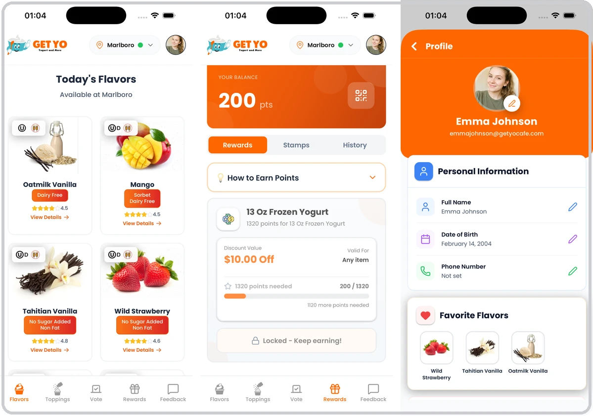
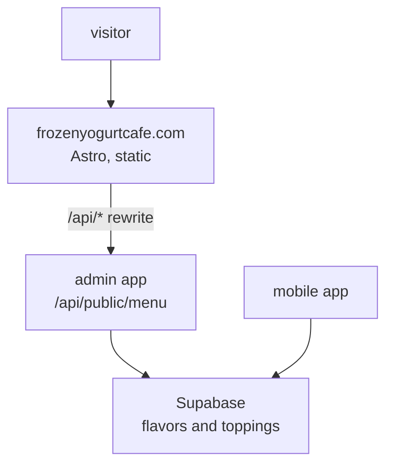
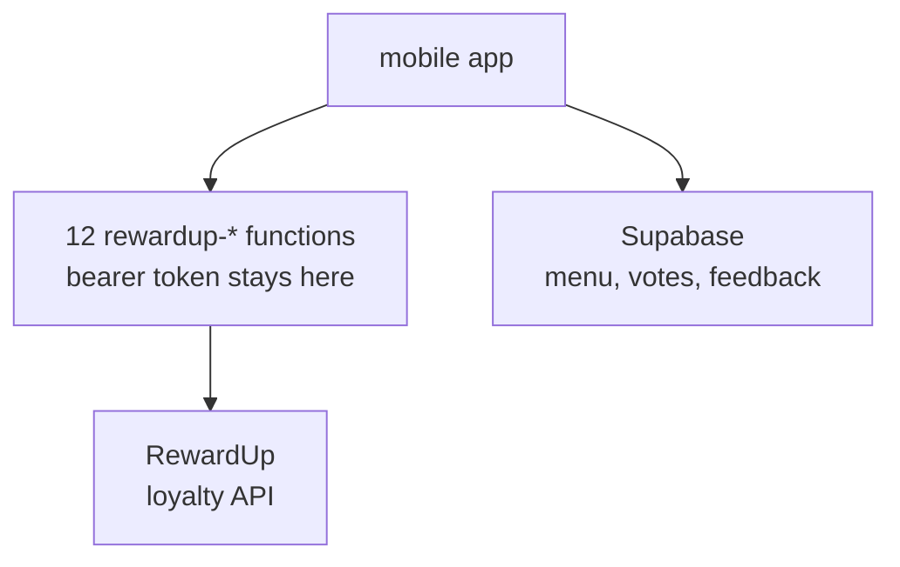
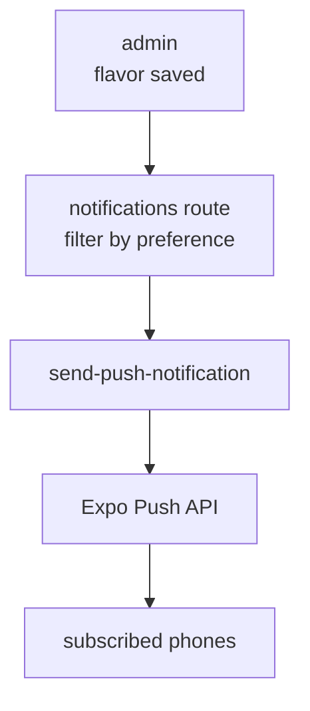
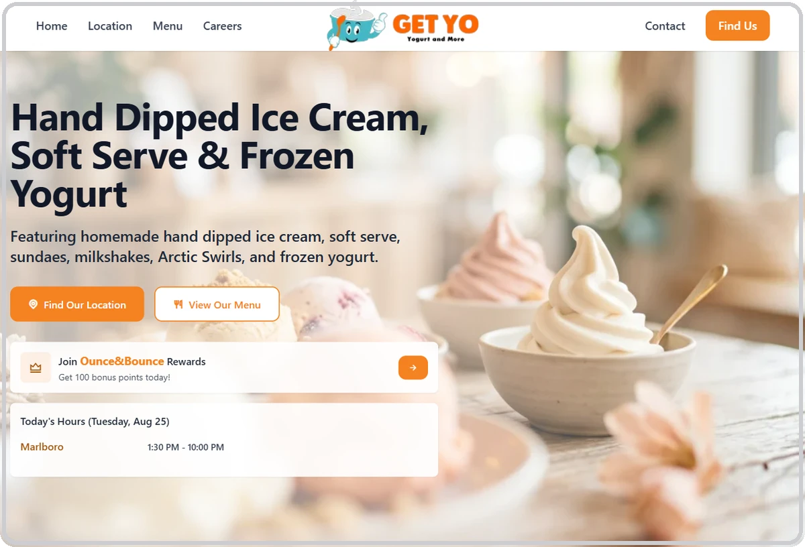
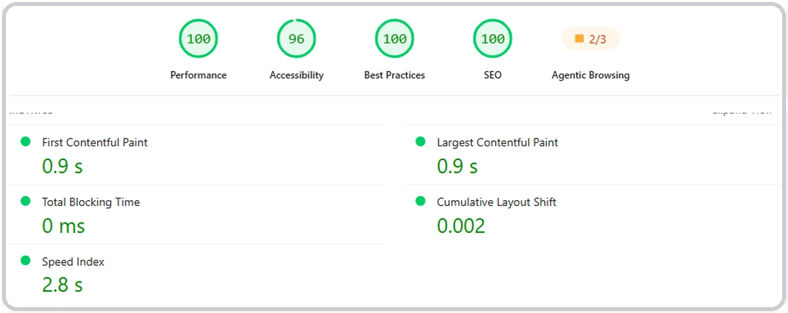

# Get Yo

A frozen yogurt shop in Marlboro, New Jersey, running on three applications I wrote — an iOS and Android app, a staff admin panel and a public website — that share one menu, one loyalty balance and one set of opening hours.

Left to right: the flavors available in the shop right now, with dietary badges and stock state · the customer's point balance and how far they are from the next reward · the profile, with favorites saved from the flavor list.

| | |
| :--- | :--- |
| Role | Sole developer of all three applications |
| Timeline | August 2025 – May 2026 |
| Status | Live on the App Store and Google Play; the business changed hands in April 2026 and I completed the technical handover |
| Links | [App Store](https://apps.apple.com/us/app/get-yo/id6753984684) · [Google Play](https://play.google.com/store/apps/details?id=com.getyocafe.app) · [frozenyogurtcafe.com](https://www.frozenyogurtcafe.com/) |

## Problem

A frozen yogurt shop does not have a menu in the sense a restaurant does. The case holds a rotating set of flavors, some of them dairy free, some no-sugar-added, several under kosher certification; toppings come and go; and any of them can run out in the middle of a Saturday. A printed board and a static web page describe the shop as it was when someone last edited them.

The shop also had a loyalty program running in RewardUp, a third-party service with its own member portal. Points, stamps and redemptions lived there, separate from anything the shop published about itself, and reachable only through a browser.

So there were three surfaces — what the shop tells the public, what the staff can change, and what a returning customer's points are worth — and no single place where any of them agreed with the others.

## What I built

**Three applications, one source of the menu.** `getyocafe-mobile` is Expo with Expo Router and NativeWind. `getyocafe-admin` is Next.js and holds the staff panel — flavors, toppings, categories, hours, reviews, feedback, voting, users and notifications. `getyocafe-web` is Astro, serving the public site. Staff edit a flavor once; the app and the website both change.

**The website stays static and still shows live data.** The Astro rebuild ran in server mode at first, and the audit list I kept for the site records switching it to static output as one of the fixes. Static output means the menu can no longer be rendered on request, so it moved to the browser: the page fetches `/api/public/menu`, and `vercel.json` rewrites `/api/*` at the edge to the admin application, which reads the same database the mobile app reads. The site shows current stock and today's hours without being a server, and the public menu cannot drift from the one in the app, because there is only one.

The rewrite is the whole trick: the browser asks the static site, the static site's host asks the admin app. No build step has to run when a flavor sells out.

**The loyalty API never reaches the phone.** RewardUp authenticates with a bearer token. A token shipped inside a mobile binary is a token anyone can extract, and it is the token that reads and writes customer point balances. So the app does not have it. Twelve of the mobile project's thirteen edge functions are single-purpose proxies — `rewardup-get-member`, `rewardup-add-points`, `rewardup-redeem-reward`, `rewardup-get-stamps` and the rest — each one accepting a call from a signed-in user, attaching the token server-side and returning only what that user is allowed to see. The token exists in Supabase's function environment and nowhere else.

Twelve functions instead of one generic pass-through, on purpose: a proxy that forwards an arbitrary path is the same security hole as shipping the token, one indirection later.

**Notifications are opt-in per category, not per app.** Each customer's profile stores separate preferences for new flavors, favorites coming back in stock, promotions and voting results. When staff save a flavor with the alert toggle on, the admin API selects only the push tokens whose owners asked for that category, and hands them to an edge function that talks to the Expo Push API. A customer who wants to know when their favorite returns does not also get promotional messages.

The filter runs before the send, not on the device. A phone that never asked for promotions is never in the list.

**Customers vote on what gets made.** Flavor voting is a first-class feature rather than a feedback box: customers vote for flavors they want in the case, earn points for voting, and staff see the results in the admin panel. The same panel takes complaints and suggestions through a structured feedback form, and a scheduled function sends birthday rewards.

**The website was rebuilt, not restyled.** Between 11 and 25 March 2026 I moved the site off its old stack onto Astro with Tailwind, inlining stylesheets and cutting client-side JavaScript to almost nothing. The project's own log records the before and after: Lighthouse performance 18, accessibility 82, best practices 73. Nutrition data, allergen filters and kosher and gluten-free certificates are part of the menu component rather than an image someone has to re-export.

Today's hours are read from the database the staff panel writes to, so a holiday closing is one admin edit rather than a deploy.

**Some of the work was not code.** I produced the printed designs used in the shop, ran the social accounts for a period, and shot and edited the video. The person deciding where the menu lives was also the person keeping the shop's public face consistent, which is part of why it ended up living in one place.

## Stack

| Layer | Choice | Why |
| :--- | :--- | :--- |
| Mobile | Expo · React Native · Expo Router · NativeWind | One codebase for iOS and Android; over-the-air fixes without store review |
| Admin | Next.js · React 19 | Route handlers give the public menu API and the staff panel one deployment |
| Web | Astro | No adapter, no client framework — the site is files, and stays fast by construction |
| Live data on a static site | Vercel `rewrites` | `/api/*` reaches the admin app without turning the site into a server |
| Data | Supabase · PostgreSQL · Auth · Storage | Menu, votes, feedback, profiles and flavor images in one managed Postgres |
| Serverless | Supabase Edge Functions | Third-party tokens and push sending stay off the client |
| Loyalty | RewardUp, proxied | The points program already existed; the app consumes it, never re-implements it |
| Push | Expo Push API | Preference filtering happens server-side, before the send |
| Email | Resend | Welcome, password reset and notification mail from verified domains |
| Hosting | Vercel | Both the site and the admin app, on the account the owner now holds |

## Outcome

- **Live on the App Store** since 4 November 2025; version 2.0.0 shipped 19 May 2026, after the handover
- **Live on Google Play**, 10+ downloads as of 26 August 2026 — the honest number for a single-location shop's own app, and the reason none of the claims here rest on install counts
- **[PageSpeed Insights](https://pagespeed.web.dev/analysis?url=https://www.frozenyogurtcafe.com/) 100 / 96 / 100 / 100 on mobile** — performance, accessibility, best practices and SEO, measured 26 August 2026, with LCP at 0.9 s, TBT at 0 ms and CLS at 0.002 on an emulated Moto G Power over throttled 4G. Desktop scores the same four, with LCP at 0.7 s
- **Performance was 18 before the rebuild**, and 51 part-way through it — both recorded in the web project's own audit log in March 2026, from local Lighthouse runs. The 100 above is PageSpeed Insights against production five months later. Different tool, different conditions: the direction is real, the pair is not a controlled benchmark
- **18 edge functions** across the mobile and admin projects
- **The business changed hands on 22 April 2026** and the systems went with it: domains, Supabase, Vercel, Resend, reCAPTCHA and both store listings, using Apple's and Google's app transfer so reviews, ratings and download history survived. The site did not go down during the transfer
- Development continued after the handover, through the last release in May 2026

The one score that is not 100 is accessibility, held there by a single contrast ratio — the same open item, with the same cause, that my March 2026 audit list recorded and did not close. [Open this report](https://pagespeed.web.dev/analysis/https-www-frozenyogurtcafe-com/qesl3xxwnj?form_factor=mobile) · [run a fresh one](https://pagespeed.web.dev/analysis?url=https://www.frozenyogurtcafe.com/)

## What broke and what I changed

**A second location that stopped existing.** The system was built for two shops, Marlboro and New Providence, and the owner told me in May 2026 that the business was no longer connected with the second one. The obvious move was to strip the concept out. I did not do that. I pinned everything to Marlboro instead — fifteen places across the two applications, listed one by one in an audit I wrote on 26 March 2026: hardcoded location names in the flavor and topping hooks, a fixed `location_id` on feedback, an auto-selected location with a hidden picker on every admin form, and a fallback of location ID 1 in the notification route.

A second audit, over the admin panel, found the reason that mattered. `app/api/public/menu` takes a `?location=` parameter and returns `locations`, `availableLocations` and `stockInfo`; `app/api/public/hours` takes `?store=`. Phones that had not installed the update were still calling those endpoints with those parameters. Stripping the location fields out of the responses would not have been a cleanup — it would have broken every copy of the app already on a phone, and an app update cannot be forced onto anyone.

So the cleanup stopped at a line: everything a customer can see is pinned to one shop, and everything the API returns is left alone. That audit lists seven files under a heading that says do not touch, each with its reason written next to it, and files what is left over — a `locations` array in the mobile store, a `setLocations` action, a `useLocations` hook that nothing calls — as dead code rather than claiming the job is finished. A known piece of dead code with a written reason is a different thing from a surprise.

**Shipping a sender address I knew was wrong.** After the transfer, welcome mail, password resets and feedback confirmations kept going out from `mail.getyocafe.com` — the old brand's domain — while the business was `frozenyogurtcafe.com`. The cause was ordinary: verifying a sending domain in Resend needs DNS records added at the registrar, and the registrar account had just moved to the new owner, who was not available. The verified domain was the old one.

The choice was between mail that looks wrong and mail that does not arrive. Password reset and signup confirmation both run through that sender; an unverified domain would have broken account creation for every new customer. So the code kept using the old verified domain deliberately, and the real fix — verify the new domain, then change the sender in the four edge functions and in the admin's `lib/resend.ts` — went into the handover document as a named task with the exact file list, not as a note to remember it. Writing down that something is knowingly wrong is the part that makes it a decision instead of a bug.

**Ownership had accreted in places nobody had looked.** Preparing the handover turned up two of these. The admin repository's `origin` still pointed at an old personal GitHub organization from an earlier phase of the project; I cleared it and set the remote up again. Then, on 4 May 2026, the Supabase project's integrations page showed a GitHub connection to that same old repository, created eight months earlier by someone else and long forgotten. Disconnecting it touched nothing in the database, auth or the edge functions — it only ended automatic branch migrations — but it was write access to production infrastructure from a repository that was no longer the project's.

The fix for the general case was to stop treating "where does this push" as something you remember. Each of the three repositories got both push URLs on a single remote, mine and the buyer's, so one `git push` lands the code in both accounts and neither can quietly fall behind. The lesson I actually took is narrower: an integrations page is not a place you visit, which is exactly why something can sit on it for eight months.

**A domain that did not survive the move.** Writing this case study in August 2026, I checked the live systems again. `frozenyogurtcafe.com` serves correctly. `getyocafe.com`, which pointed at the staff admin panel, returns a Vercel deployment-not-found error — the custom domain did not come back up after the projects moved to the new owner's account, so the panel is now reachable only at its generated hosting URL. The same domain is still registered in the reCAPTCHA console, and the mail sender above still refers to it.

Two of the project labels in my own handover log are also swapped relative to what the hosting account actually serves, which is how a document written during a transfer goes stale: it recorded the intent, and the intent was edited afterwards. I no longer administer these systems, so this is a finding rather than a fix — but it is the most useful thing in this section. A handover is not finished when every checkbox is ticked. It is finished when someone re-reads the checklist against the running system months later, and I only did that because I sat down to write this.
