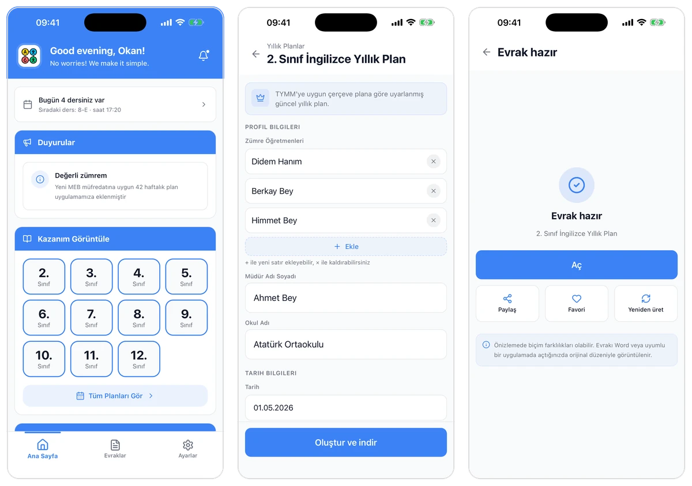
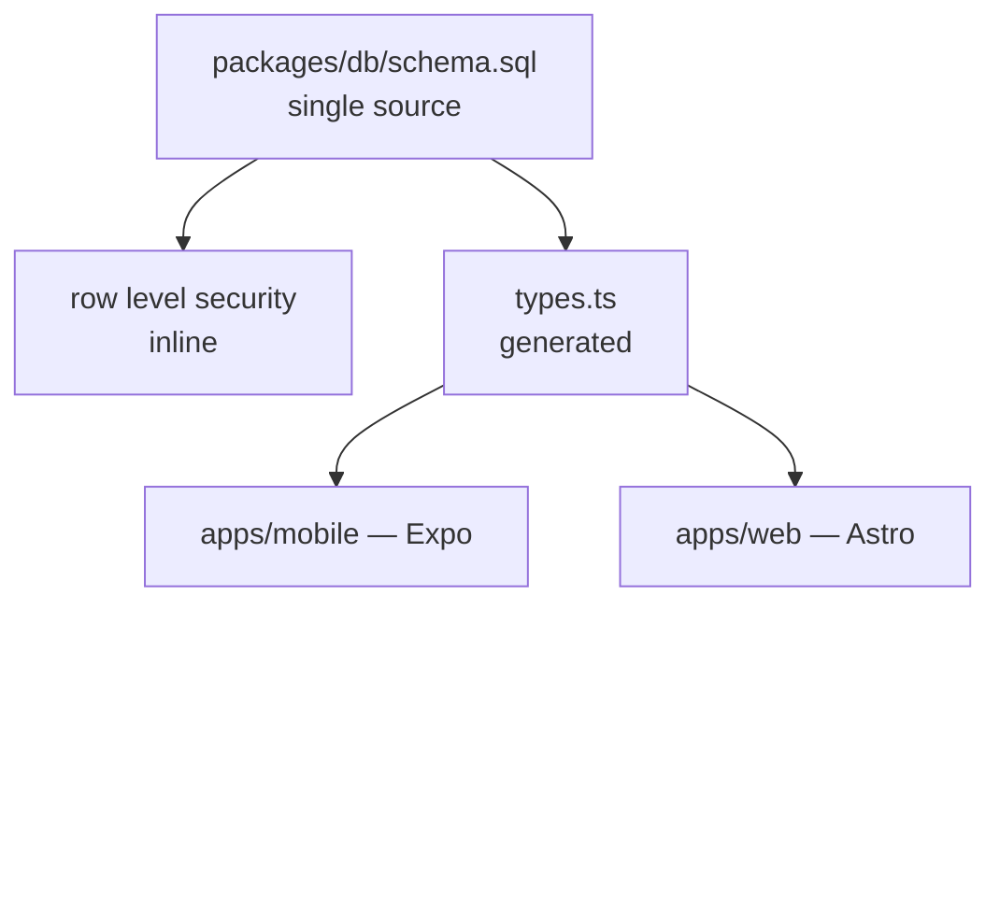
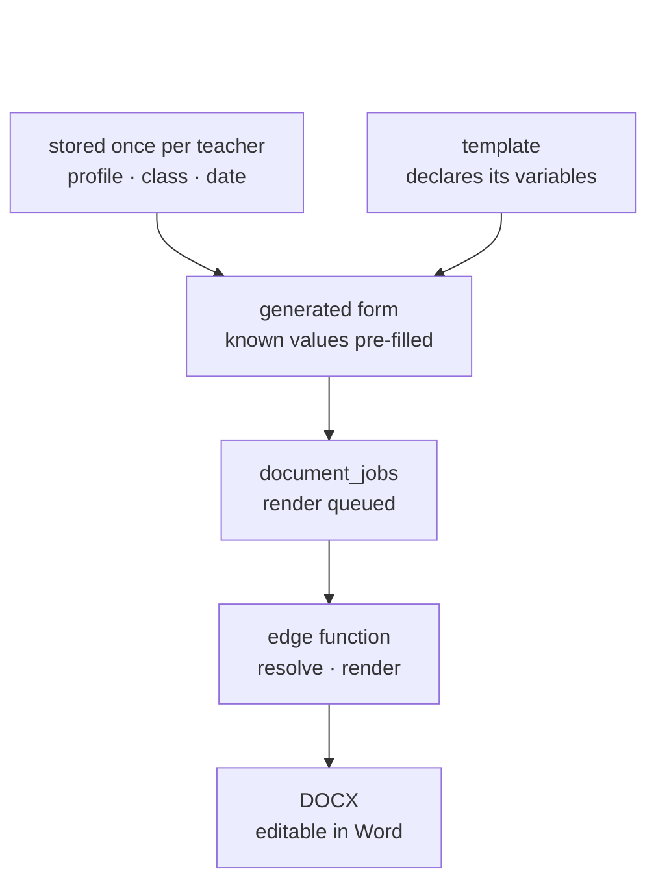
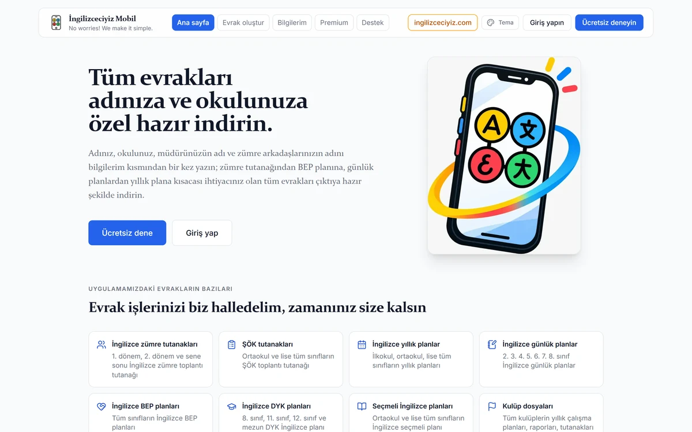
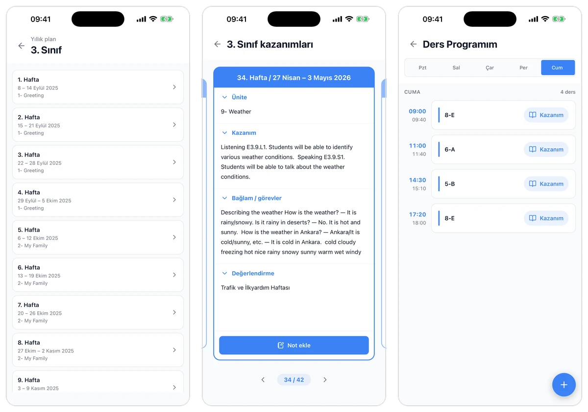
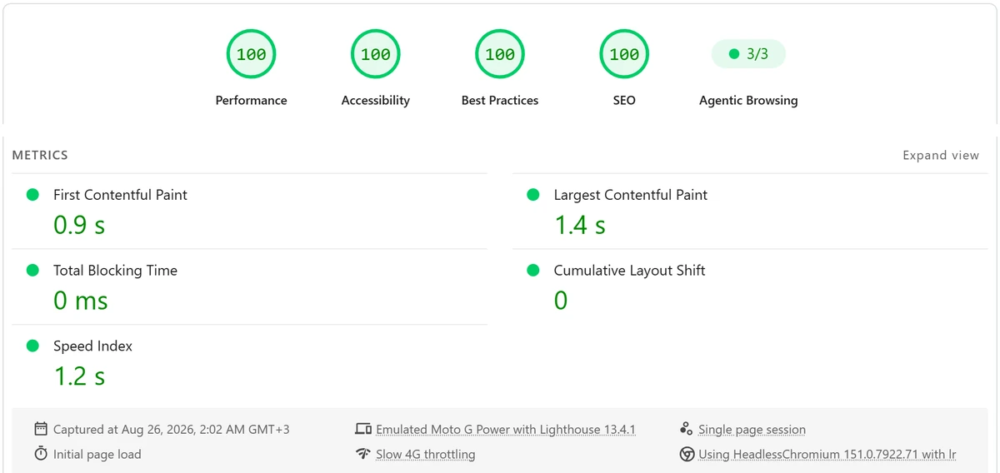

# İngilizceciyiz

A digital assistant for English teachers in Turkey that automates the creation of personalized school documents — yearly and daily lesson plans, BEP and DYK plans, elective course plans, club files, department minutes and ŞÖK meeting records — while keeping class plans, schedules and teaching notes available on both mobile and web.

Left to right: the teacher's home screen · the form for a yearly plan, with profile and date fields already filled from the account and the academic calendar · the finished document, ready to open in Word.

| | |
| :--- | :--- |
| Role | Sole developer of the current platform |
| Timeline | August 2025 – present · app in the stores since September 2023 |
| Status | Live on the App Store and Google Play |
| Links | [App Store](https://apps.apple.com/tr/app/ingilizceciyiz/id6459478322) · [Google Play](https://play.google.com/store/apps/details?id=com.ingilizceciyiz.ingilizceciyiz) · [ingilizceciyizmobil.com](https://ingilizceciyizmobil.com) |

## Problem

Turkish teachers are required to file a large amount of paperwork every term. A single English teacher produces yearly plans, daily lesson plans, BEP plans for students on individualized programmes, DYK plans for support courses, elective course plans, club files and department meeting minutes — each in its own official format, each due around the same weeks.

Two things make this expensive. The first is finding the correct, current template for each document. The second is that every one of those templates asks for the same information again: the teacher's name, the school, the principal, the department, the class, the academic dates. So the work is not writing — it is locating a file, opening it in Word, and retyping details that have not changed since the last document, once per document, once per class, every term.

## What I built

**Rebuilt from scratch.** The app had been in the stores since 2023 when I took it over in August 2025. Everything below is the platform I wrote to replace it; the rebuild shipped in April 2026 and has been the live product since.

**Fill it in once, reuse it everywhere.** The core of the data model is a `variables` table whose every entry belongs to one of four namespaces: `profile`, `class`, `date` or `custom`. Profile variables come from the teacher's account, class variables from the class they picked, date variables from the academic calendar, and only genuinely one-off values are typed by hand. A companion table binds each document template to the variables it needs, marking which are required and in what order — so the form a teacher sees is generated from the template itself, already filled with everything the system knows.

The output is a DOCX. Teachers still have to hand these documents to an administration that works in Word, so generating a PDF would have solved the wrong problem — the file has to stay editable after it is produced.

**One monorepo, two apps, one schema.** `apps/mobile` is Expo with Expo Router and NativeWind. `apps/web` is Astro, serving the public site and the `/admin` panel from a single application. Both consume `packages/shared` for design tokens, error types, analytics and validation schemas, so a change lands in both instead of being copied into each.

**The schema is the single source of truth.** `packages/db/schema.sql` holds the tables with their row level security policies inline, and TypeScript types are generated from it. Migration files still exist but are explicitly demoted to historical reference, recorded as ADR-0012 rather than left as folklore. The schema, the access rules and the types cannot drift apart, because two of the three are derived from the first.

One file to edit. The types are regenerated from it and the access rules sit beside the tables they protect, so none of the three can quietly fall out of step with the others.

**Document generation runs off the client.** Supabase Edge Functions parse each plan type, resolve template variables, render the DOCX and hand back a signed URL. Generation is tracked as a job, so a slow render never blocks the app.

The top row is stored once and reused by every template. Everything below the form is derived, which is why producing the next document requires almost no repeated data entry.

**CI enforces what review would otherwise have to catch.** GitHub Actions runs lint, typecheck and build, deploys edge functions, and runs `gitleaks` for secret scanning alongside a dependency audit. A Husky pre-push hook applies the same rules locally through Turborepo, so failures arrive before the push rather than after it.

**Backups are a feature, not a runbook step.** A dedicated edge function verifies the caller is an admin, dumps a whitelist of tables — user-generated documents deliberately excluded — and writes an audit entry attributed to the person who ran it, not to the service role. The admin panel downloads the result in one click. Whatever the hosting platform gives you by default is a floor, not a plan.

**Delivery is deliberately boring.** Web deploys to Cloudflare Pages on push to `main`. Mobile builds through EAS, and JavaScript-only fixes ship as over-the-air updates without waiting for store review — which matters when a teacher hits a bug during a lesson.

**Performance is a budget, not a hope.** The home page scored 94 on Lighthouse performance one week and 72 the next, and six days passed before anyone noticed — a hero animation, a React theme island and analytics loading too early. So I wrote a measurement command: it runs Lighthouse under a mobile preset on throttled 4G, applies a resource and timing budget, takes the median of several runs and exits non-zero if any category falls below its threshold. I keep it out of CI on purpose and run it whenever the three files behind that regression are touched, so the check stays a decision rather than an automatic gate. In the most recent measured run, on 26 August 2026, the live site scored 100 in all four PageSpeed Insights categories on mobile.

The website's own promise, unchanged since: enter your name, school, principal and department colleagues once, then download every document you need.

**The paperwork is not the whole product.** A yearly plan runs 42 weeks, and each week carries its unit, learning outcomes, tasks and assessment. Teachers read those during the lesson and attach their own notes to them, and the schedule view links every period back to the week it belongs to.

Left to right: the 42 weeks of a yearly plan · a single week with its unit, outcomes, tasks and assessment · the teacher's own timetable.

## Stack

| Layer | Choice | Why |
| :--- | :--- | :--- |
| Mobile | Expo · React Native · Expo Router · NativeWind | One codebase for iOS and Android; OTA patches without store review |
| Web | Astro | Public site and admin panel in one app, almost no JavaScript shipped to visitors |
| Shared | pnpm workspaces · Turborepo | Design tokens, schemas and error types defined once |
| Data | Supabase · PostgreSQL | Row level security written inline, next to the tables it protects |
| Types | Generated from `schema.sql` | Schema and TypeScript cannot drift |
| Serverless | Supabase Edge Functions | Template parsing and DOCX rendering off the client |
| Billing | RevenueCat | Subscriptions and webhooks handled once for both stores |
| CI | GitHub Actions · Husky · gitleaks | Lint, typecheck, build, secret scan, dependency audit |
| Delivery | Cloudflare Pages · EAS · EAS Update | Push to deploy on web, over-the-air patches on mobile |

## Outcome

- **28,963 documents generated** by **3,416 teachers** as of 9 October 2026 — about eight and a half each
- **6,679 teacher accounts** on the same date
- **1,069 document templates** built across eight categories
- **23,000+ downloads** — 13,594 on the App Store, 10,000+ on Google Play
- **In the stores since September 2023**, across three back-to-school cycles; the rebuilt platform shipped in April 2026
- **[PageSpeed Insights](https://pagespeed.web.dev/analysis?url=https://ingilizceciyizmobil.com/) 100 / 100 / 100 / 100 on mobile** — performance, accessibility, best practices and SEO, measured 26 August 2026, with LCP at 1.4 s, TBT at 0 ms and CLS at 0 on an emulated Moto G Power over throttled 4G
- Over 1,100 commits, still in active development

The run conditions matter as much as the score: an emulated Moto G Power on throttled 4G, first page load, no warm cache. [Open this report](https://pagespeed.web.dev/analysis/https-ingilizceciyizmobil-com/jns9abevrm?form_factor=mobile) · [run a fresh one](https://pagespeed.web.dev/analysis?url=https://ingilizceciyizmobil.com/)

Demand follows the school year rather than the calendar. September is consistently the peak — 2,041 downloads in September 2023, 1,632 in 2024, 1,940 in 2025 — while July and August drop to a fraction of that, because much of the paperwork these documents replace is concentrated around the start of term. Release planning is built around it: risky changes ship in spring, and the weeks before September are reserved for stability work, since that is when the largest group of new teachers opens the app for the first time.

## What broke and what I changed

**A row limit that fails silently.** The admin panel's template list showed 1,000 templates when the table held 1,002. Two yearly plans — third and fourth grade, restored from a backup and therefore carrying old timestamps — sat at rows 1,001 and 1,002 under a `created_at desc` sort and never reached the screen. A category count read 9 where the real number was 11. Mobile was unaffected, because its query filtered by `is_active` and category and stayed under the ceiling, which is why the fault went unseen for a while. The cause was PostgREST's `db_max_rows`, which Supabase defaults to 1,000: the limit is enforced server-side, so asking for `.range(0, 9999)` changes nothing. It also returns no error. The rows are simply not there.

I raised the ceiling, first to 2,000 and later to 9,000, and that was the wrong fix. A higher ceiling does not remove the trap, it postpones it, and the failure mode stays the same: silent truncation with a successful response. The real change came later, when the device and document pages moved to RPCs that group, filter, search and paginate in the database. The trigger was not the ceiling but the absence of pagination — eleven hundred devices were being rendered on one screen. That same pass closed a query fetching every `downloads_log` row from the last 24 hours, which feeds the column a device ban is decided on. Losing rows there, without an error, would have been the worst version of this bug.

**A decision I reversed the same day.** I chose Drizzle ORM for schema management, wrote the ADR, and replaced it with a second ADR hours later. The type-safe query builder was real value, but it arrived with `drizzle-kit`, a `DATABASE_URL`, a hook keeping `schema.ts` and `schema.sql` in sync, and four database scripts to maintain. Most of what that surface buys — migration ordering, drift detection, team synchronisation — protects against problems a single developer on a single project does not have. Meanwhile `supabase gen types` already produced a fully typed client. Both ADRs are still in the repository, the superseded one marked as such, because the reasoning is worth more than the conclusion.
