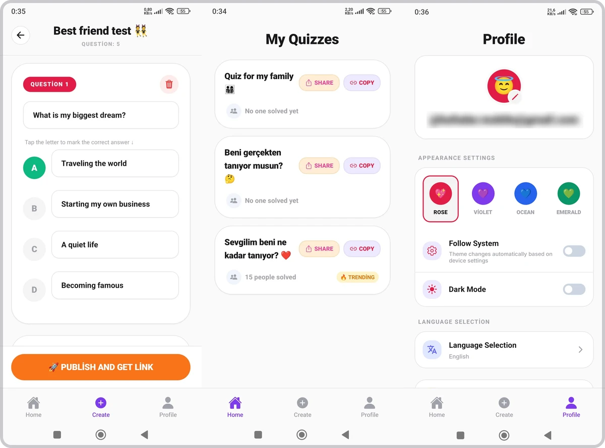
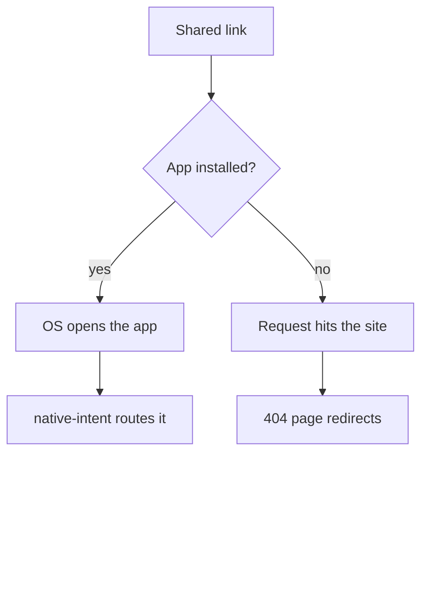
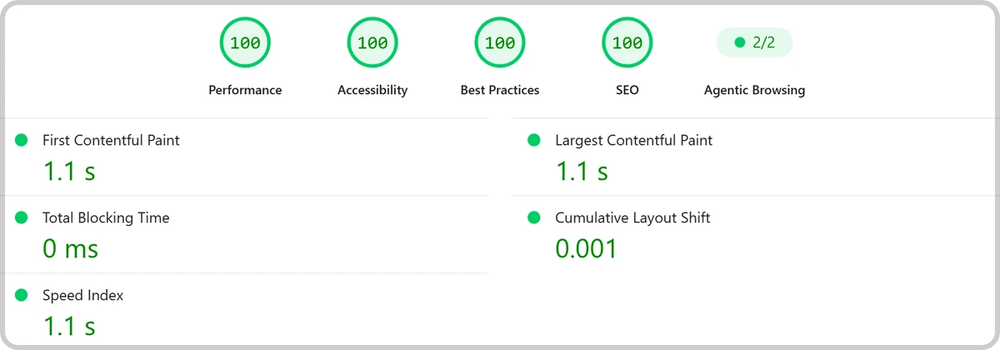

# Kafadar

A quiz app where you write questions about yourself, share one link, and see how well your friends actually know you.

Left to right: writing a question and marking the correct answer · the quiz list, where every quiz carries its own share and copy buttons · the profile screen with themes and language. The email on the third screen is a project account, blurred here because there is no reason to republish an address.

| | |
| :--- | :--- |
| Role | Sole developer |
| Timeline | 12 February – 8 March 2026 · 108 commits on the app, 24 on the site |
| Status | Live on Google Play · Android only · backend on Supabase's free tier |
| Links | [Google Play](https://play.google.com/store/apps/details?id=com.schwerttr.kafadar) · [kafadar-web.vercel.app](https://kafadar-web.vercel.app/) |

## Problem

An app like this has one mechanism and everything else is decoration. You make a quiz, you send the link to someone, they open it. If the link does not land, there is no product — no amount of polish inside the app compensates for a share that dead-ends.

That makes the interesting engineering problem a routing problem, and a wider one than it first looks. One URL has to serve three arrivals that want three different things: someone with the app installed, someone without it, and a crawler generating a preview when the link gets pasted into a chat. Android is the only client I shipped, so that is the path that actually runs; the iOS association is configured in the repo against a client that was never published. And the one who decides which branch you get is not me — it is the operating system, before any of my code runs.

Everything below is either about getting that right or about what it cost me when I did not.

## What I built

**One link, resolved by the OS before the app sees it.** The share URL is `kafadar-web.vercel.app/q/{slug}`. On Android an intent filter claims the `/q/` prefix, verified by `assetlinks.json` at `/.well-known/`. That is the shipped path: when the file is in place and the app is installed, tapping the link never touches the web at all, because the OS hands it straight to the app. The same arrangement exists for iOS — `associatedDomains: ['applinks:kafadar-web.vercel.app']` in `app.config.js`, and an `apple-app-site-association` file the site serves — but there is no iOS client on the App Store for it to point at. It is configuration waiting for a build that never shipped.

The branch is decided by the operating system, before any of my code runs — which is why one static file on the website governs whether the left-hand path exists at all. The crawler is not on this chart because it has no good answer yet: a link preview follows the right-hand path and reads a 404.

**A router in front of the router.** Expo Router's `+native-intent.tsx` gets the raw string before any screen mounts, and it has to be tolerant, because what arrives is not always what was sent. It might be `kafadar://q/abc`, a full `https://` URL, a bare `/q/abc`, or a password-reset callback. So `redirectSystemPath` strips the custom scheme, then tries the path both as a raw fragment and as a parsed `URL` pathname, matching `/q/`, `/quiz/` and `/reset-password` at each stage, and returns the original path untouched if nothing matches. The whole function sits inside a `try/catch` that also returns the original path. That return is a pass-through, not a redirect to safety: an unmatched path is handed to the router as-is and resolves to `+not-found` if nothing claims it. Which is the point — a deep link the app cannot parse should land somewhere harmless, and above all should not throw inside the handler that runs before any screen exists.

**A companion site that talks to no database.** `kafadar-web` is Astro, and it deliberately has no Supabase client. It exists to serve the two `.well-known` files, host the privacy policy, terms and account-deletion pages the store requires, and give the link somewhere to land. Keeping the database out of it means the site cannot break in a way that takes the app's link handling with it — and, as it turned out later, it means the site stays up even when the backend does not.

**Four tables, no more.** `profiles`, `quizzes`, `questions`, `responses`. A quiz owns its questions by `sort_order`, carries a unique `slug` for the URL, and caches `total_responses` so a list can render without counting rows. A response stores the score, the total, the percentage and the answers as JSONB, and its `respondent_id` is nullable — answering someone's quiz does not require an account. That single nullable column is the difference between a link a stranger can open and a link that asks them to sign up first.

**Ads only, and the reasoning is written down.** A rewarded video to publish a quiz, one interstitial after solving. `docs/04-monetization.md` records why there is no subscription, and it is four lines that are more useful than the decision itself: the audience is young so a payment barrier is high, ad revenue converts better for this kind of app, the product is not deep enough to be worth a premium tier yet, and a RevenueCat integration is maintenance I would be paying for nothing. Whether that judgement is right is arguable. It being written down is what let me leave it alone.

## Stack

| Layer | Choice | Why |
| :--- | :--- | :--- |
| App | Expo SDK 54 · React Native · Expo Router | `+native-intent` is the reason — deep-link handling that runs before routing |
| Data | TanStack Query over Supabase | Quiz and answer lists are cache-shaped; the query layer handles staleness rather than each screen |
| Backend | Supabase | Auth plus four tables; no server of my own to keep alive |
| Styling | NativeWind | Same class vocabulary as the Astro site, so the two surfaces do not drift |
| Site | Astro, fully static | No database client on purpose; it cannot fail in a way that breaks the app's links |
| Ads | AdMob | Rewarded to publish, interstitial after solving |
| i18n | i18n-js | 25 locale files behind 23 offered languages — see below |

## Outcome

- **Live on Google Play since 8 March 2026** at version 1.0.0, never updated since — [`com.schwerttr.kafadar`](https://play.google.com/store/apps/details?id=com.schwerttr.kafadar), **10+ downloads**, Android 7.0 and up, verified 26 August 2026
- **108 commits in 25 days** on the app, 12 February to 8 March 2026, plus 24 on the site
- **PageSpeed 100 / 100 / 100 / 100 on mobile and on desktop** as of 26 August 2026 — up from 84 / 87 / 100 / 92, with the whole climb measured and linked below
- The backend runs on Supabase's free tier, which pauses projects that show low activity over a 7-day period. It had paused. I resumed it on 26 August 2026, which is the only reason anything on this page could be checked against a running system

Mobile, emulated Moto G Power on throttled 4G, first load, no warm cache. First Contentful Paint, Largest Contentful Paint and Speed Index all land at 1.1 s, which is what it looks like when nothing is left on the critical path. [Open this report](https://pagespeed.web.dev/analysis/https-kafadar-web-vercel-app/tl80qtljc0?form_factor=mobile) · [run a fresh one](https://pagespeed.web.dev/analysis?url=https://kafadar-web.vercel.app/)

## What broke and what I changed

**The ad and the result screen raced each other.** At the end of a quiz the app showed an interstitial and then moved to the score screen. On some devices it crashed with `Couldn't find a navigation context`. The cause was that `showQuizFinishInterstitial()` awaited the ad's `show()` call but not the ad's dismissal, so `setStep('score')` could fire while the ad overlay was still mounted, and the state transition and the ad teardown competed for the same navigation tree.

The fix was to make the function wait for the thing it actually cared about: `AdEventType.CLOSED` or `AdEventType.ERROR`, with a twenty-second timeout so a failed ad cannot strand the user on a finished quiz forever, and guaranteed listener cleanup so a second quiz does not inherit the first one's handlers. On the screen side an `isMountedRef` guards the score update. Awaiting `show()` looked like awaiting the ad. It was awaiting the request to display one.

**The share link returns 404.** This is the one that bothers me most, because it sits exactly on the mechanism the product depends on. There is no `/q/{slug}` route in the site — no page, no rewrite, nothing prerendered. A shared link hits Vercel's static handler and gets an HTTP 404. What saves it is a script inside the custom 404 page, which matches `/q/` or `/quiz/` in the path and redirects to `/deeplink?slug=…`.

For a person with JavaScript it works. For everything else it does not: the status code is 404, so a chat client generating a link preview sees an error page, and so does a crawler. And the people it fails are precisely the ones the share is for — anyone who already has the app never reaches the web, because the OS intercepts the link first. The design doc for this feature asked for a "web fallback landing page (basit static site)". What shipped was a 404 with a redirect in it. It is still that way; I have not been back to the project since March.

**The site was slow, and the reason was one file.** Measured on 26 August 2026 it scored 84 on mobile with a Largest Contentful Paint of 3.9 s — on a static Astro page that ships 10.5 KB of HTML and a single script tag. The framework was not the problem. `logo.png` was: a 1024×1024 PNG weighing 337 KB, used in three places at 40 px, 160 px and 64 px. The hero copy of it was the LCP element.

Serving three WebP variants at the sizes actually rendered took the LCP image from 337 KB to 6.0 KB and moved the score to 91, with LCP at 2.6 s. But First Contentful Paint had not moved at all, and LCP had simply come down to sit on top of it — which is the useful signal. The image had stopped being the bottleneck and the first paint itself had become one. That was the render-blocking stylesheet request to `fonts.googleapis.com`: a third-party origin on the critical path, costing a DNS lookup, a TLS handshake and a CSS round trip before anything could paint. Self-hosting the font as a single variable file removed the origin entirely and FCP dropped from 2.6 s to 1.1 s.

The last points came from the same principle applied to what was left. The App Store and Google Play badges were being fetched from Apple's and Google's CDNs — two more origins, one of them redirecting to a third host that my `preconnect` hint did not even name. Self-hosting both removed them. And the single 5 KB stylesheet, small enough that fetching it as a separate render-blocking request cost more than the bytes it saved, went inline. Mobile reached 100, and Speed Index — which had wandered up to 4.3 s in the middle of this and had me suspicious of my own `loading="lazy"` — came back to 1.1 s. It had been run-to-run noise the whole time. Lab metrics move; a single measurement is a data point, not a finding.

**The accessibility points came from three unrelated small things.** Performance was the loud number, but the same run had accessibility at 87 and SEO at 92, and those turned out to be cheap. The footer used `text-gray-400` on white, which measures about 2.6:1 where the standard asks for 4.5:1. A heading inside the phone mockup illustration was an `<h3>` sitting directly under the page's `<h1>`, skipping a level — it is decorative content, not a section, so it became a `
` and the outline went back to `h1 → h2 → h3`. And the App Store badge, greyed out because there is nothing to link to, was an `<a href="javascript:void(0)">`, which fails the "links are crawlable" audit for the honest reason that it is not a link. It is a button that pops a message, so it became one. Both categories reached 100.

**The badge fix I inherited treated the symptom.** While measuring the above I noticed the two store badges were visibly different sizes. The cause is worth writing down because the earlier repair was reasonable and still wrong. Google's badge artwork occupies only 76.8 % of its PNG's height; the rest is transparent clear space. Apple's is tight-cropped. Give both the same box height and Apple's looks a third larger.

Someone — me, in a commit called `adjust store badge proportions` — had compensated by giving the Google badge a taller container: `h-[4.8rem] sm:h-[5.5rem]` against Apple's `h-10 sm:h-12`. That is a factor of 1.92, when the padding only called for 1.30. It was a number tuned until it looked acceptable at one breakpoint, layered on top of a second bug nobody had spotted: those height classes were on `<a>` and `<button>` elements, which are inline by default, so `height` was doing nothing at all and the images were falling back to intrinsic size.

The actual fix was to stop compensating and remove the cause. Trim the transparent padding out of the asset, make both containers `inline-flex` so their height classes apply, and let both images be `h-full w-auto`. Both badges now render at 40 px tall — 151 × 40 and 135 × 40 — from one shared class. The clear space Google's guidelines ask for is still there; it is just expressed as layout spacing instead of baked into an image.

**Twenty-five language files, twenty-three offered.** `i18n.tsx` registers 25 locales; the profile screen lists 23. The two missing from the picker are generic Portuguese and generic Chinese, and they are absent on purpose: they stay registered as catch-all fallbacks for device locales, while the user is offered the more specific `pt-BR` and `zh-Hans`/`zh-Hant` instead. It is a small thing, but it is the kind of gap that reads as a bug six months later if the reason is not written down next to it.
