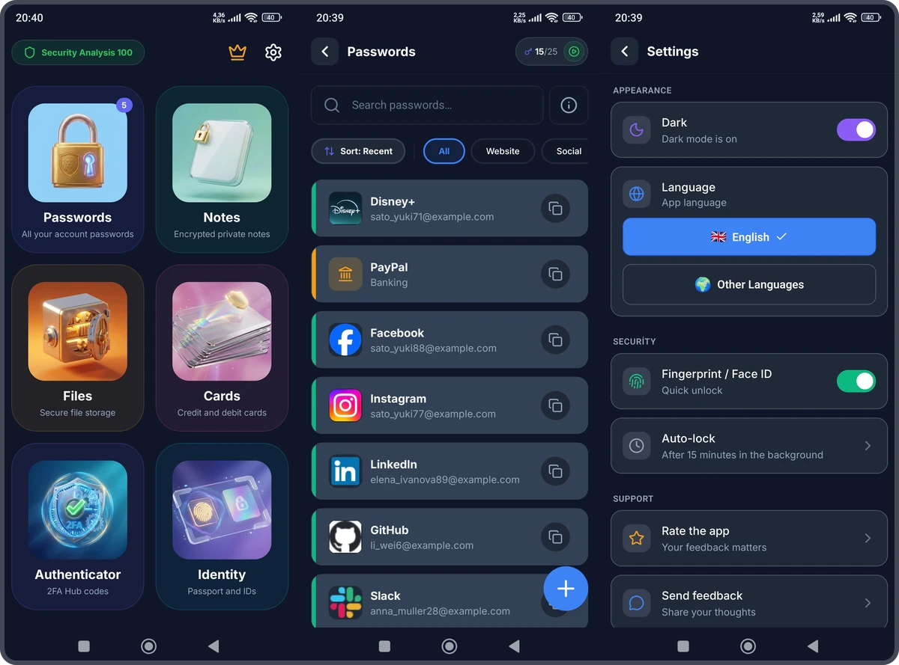
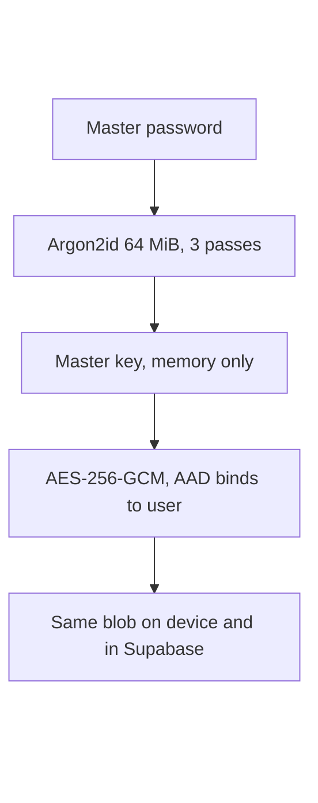
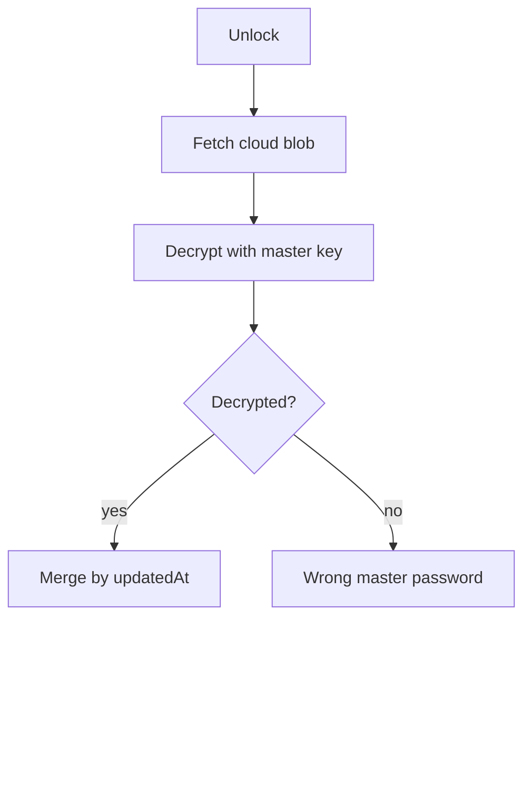

# QuSafe

An encrypted vault for passwords and notes where the key is derived on the device and stays there — the server only ever holds a blob it cannot read.



<sub>Left to right: the hub · the password list, shown here with seed data · the security settings, where the biometric switch and the auto-lock timeout live. Passwords and Notes are the two modules that ship today; the other four tiles are placeholders for modules I have not written.</sub>

| | |
| :--- | :--- |
| Role | Sole developer |
| Timeline | 10 December 2025 – 27 January 2026 · 636 commits in 49 days |
| Status | Live on Google Play at 1.4.0 · Android only · no commits since January 2026 |
| Links | [Google Play](https://play.google.com/store/apps/details?id=com.schwerttr.qusafe) |

## Problem

There is no gap in the market for another password manager. 1Password and Bitwarden exist, they are audited, and they are better funded than anything I will write alone.

The reason to build one anyway was that I wanted to make the cryptographic decisions myself instead of calling a library that had already made them. Which key derivation function, at which cost parameters, and on whose recommendation. What the additional authenticated data is bound to. Where the master key lives while the app is open and what happens to those bytes when it locks. How a device tells a stale cloud copy from a cloud copy encrypted under a different password, when the server is not allowed to help.

Those questions have concrete answers, and getting them wrong is not a bug you find in review — it is a product that looks identical from the outside and protects nothing. So the honest description of this project is that the app is the artefact and the decisions are the work.

## What I built

**A key that is derived on the device and never leaves it.** The master password is normalised to NFKC first, so the same password typed on two platforms produces the same bytes. Argon2id derives a 256-bit key from it at 64 MiB of memory, three passes and four lanes — RFC 9106's second recommended option, the one written for memory-constrained environments, which is what a phone is. That is several times the current OWASP Password Storage Cheat Sheet minimum of 19 MiB at two passes, and the cost is paid once per unlock rather than per operation. Verification compares a SHA-256 hash of the derived key against the stored one with a constant-time compare rather than `===`. Everything in the vault is then sealed with AES-256-GCM: a fresh 12-byte IV per encryption, a 16-byte auth tag, and for anything that goes to the cloud, `v1|uid=<user_id>` as additional authenticated data, so a blob lifted from one account fails authentication in another. When the vault locks, `cachedMasterKey.fill(0)` runs before the reference is dropped.



<sub>The chain has one property that decides everything downstream: nothing to the right of the master key can be recovered without it. Forgetting the master password does not mean a reset link, it means the vault is gone — which the app says plainly rather than implying otherwise.</sub>

**Biometric unlock without ever storing the master key.** The biometric does not hold the key. A random 256-bit key-encryption key wraps the master key, and only that KEK goes to `SecureStore` with `requireAuthentication: true`, so the OS prompt is what releases it. Extracting the wrapped key from the device buys nothing without the KEK, and reading the KEK requires the biometric.

Local storage sits underneath all of this as a second, independent layer. What the vault store writes to disk is already ciphertext — `encrypt(vaultJson, masterKey)` runs before storage is touched — and that is then handed to an encrypted MMKV instance whose key is generated from 32 random bytes on first run and kept in the platform keystore. Worth being precise about what this layer is and is not: MMKV documents a maximum encryption key length of 16 bytes, so it is not carrying the full 32 bytes as a cipher key, and I would not claim the local file is protected at the same strength as the vault inside it. It does not need to be. The vault's confidentiality rests on the master password and the key derived from it; the MMKV layer is defence in depth over data that is already sealed.

**A weaker fallback that cannot reach production.** Argon2id needs a native module, which Expo Go does not have, so the KDF has a SHA-256 iteration fallback for development. Shipping that by accident would have been the worst failure this app could have — a vault that looks encrypted and is trivially crackable. The fallback is therefore guarded by a throw, not a warning:

```ts
if (!__DEV__) {
    throw new Error('Native Argon2 required in production - use a development build');
}
```

A production build that somehow lost the native module refuses to derive a key at all. Failing to open is recoverable; opening with a weak key is not.

**The schema versions the cryptography before there is anything to migrate.** The `vault_sync` row carries `kdf_algorithm`, `kdf_iterations`, `kdf_version`, `kdf_params` as JSONB, `cipher_version` and `key_version` alongside the ciphertext and the salt. Today every row says the same thing: Argon2id, three passes, 64 MiB, version 1. The point is what happens the day those parameters stop being enough. Because they travel with the blob rather than living as constants in the client, an old vault can be opened with the parameters it was written under, re-encrypted under the new ones, and its version bumped — instead of every existing user being locked out by an app update. `docs/security/kdf-versions.md` reserves version 2 and writes down that migration path while it is still hypothetical.

**A server that cannot decrypt has a cost, and it shows up in sync.** The server stores `encrypted_data`, `key_salt` and the KDF parameters. It cannot tell a client whether the cloud copy belongs to the same master password, because it cannot read either one. So the client finds out the only way available: it downloads the blob and tries to decrypt it. Success means the copies are comparable and a merge can be offered. A decryption failure is not an error to log — it *is* the answer, and it means the cloud vault was written under a different master password.



<sub>The `catch` around the decrypt call is the whole detection mechanism. In a system where the server can read the data, this is a column comparison; here it is an exception, and the exception carries information.</sub>

**Local-first writes, with the cloud as the arbiter.** Edits land in the encrypted local store immediately and sync is debounced behind them. Before pushing, the client reads `sync_version` from the cloud; if that version is not behind the local one, the push is abandoned and the cloud copy is downloaded over the local one instead. The comment in `vaultStore.ts` states the rule without decoration — `STRATEGY: Cloud always wins - auto download and replace local`. The gentler path exists separately, at unlock: when both sides have content and the cloud copy decrypts, the user is offered a merge that resolves item by item on `updatedAt`. Deletions are not removals but tombstones — a `deletedAt` marker travels with the item, so a delete on one device is not undone by a sync from another that never saw it. Every count the app shows filters tombstones back out.

**Nine tenths of the app is two modules.** Passwords and Notes are roughly 5,500 lines between them; the hub, settings, security scoring, sync and onboarding make up the rest. Four module directories — `cards`, `files`, `authenticator`, `identity` — are empty, and their tiles on the hub are placeholders. Five tables back all of it (`user_profiles`, `vault_sync`, `qr_shares`, `revenuecat_webhooks`, `app_config`), each with row level security enabled, with the webhook table restricted to `service_role`. There is exactly one edge function, for the RevenueCat webhook; nothing else needs a server, because nothing else is allowed to see plaintext.

**Free, with ads, and a Pro tier.** Rewarded video buys bonus entries above the free limit; interstitials are frequency-capped at one per three minutes in code. Subscriptions go through RevenueCat, and its webhook is the only thing that writes premium status. This matters to the engineering because the ad SDK and the lock behaviour ended up fighting each other — see below.

**Translated into ten languages, offered in fifty-nine.** `languages.ts` lists 59 languages; `locales/` holds ten JSON files: Arabic, German, English, Spanish, French, Hebrew, Italian, Portuguese, Russian and Turkish. Rather than hide the gap, `supportedLngs` is derived from the files that actually exist and the picker splits the list into active and coming soon. Hebrew is the reason the app has right-to-left support at all, and the reason for the crash in the next section.

## Stack

| Layer | Choice | Why |
| :--- | :--- | :--- |
| App | Expo SDK 54 · React Native 0.81 · Expo Router | One codebase, and OTA updates pinned to the app version so a runtime never meets the wrong native build |
| Architecture | Feature-Sliced Design | `app/` routes, `src/modules/` features, `src/shared/` core — crypto and i18n live in one place, not per screen |
| KDF | `react-native-argon2` | Argon2id is the PHC winner and memory-hard; bcrypt and PBKDF2 are not |
| Cipher | AES-256-GCM via `react-native-quick-crypto` | Authenticated encryption, and AAD to bind ciphertext to an account |
| Local store | MMKV, encrypted | Synchronous reads at unlock, with a device key from the platform keystore |
| State | Zustand | Separate stores for UI and vault, so locking wipes one without touching the other |
| Backend | Supabase | Auth and one table of ciphertext — row level security is the whole authorisation model |
| Billing | RevenueCat | One webhook is the sole writer of premium status |
| Ads | AdMob | Rewarded video for bonus limits, interstitials capped in code |
| Monitoring | Sentry | PII redaction in `beforeSend`, no session replay, `sendDefaultPii: false` |

## Outcome

- **Live on Google Play since 26 January 2026**, at version 1.4.0 — [`com.schwerttr.qusafe`](https://play.google.com/store/apps/details?id=com.schwerttr.qusafe), **100+ downloads**, verified 26 August 2026
- **42 encrypted vaults** in `vault_sync`, the first written 27 January 2026 — the day after release — and the most recent updated **25 August 2026**, seven months after the last commit
- **636 commits in 49 days**, 10 December 2025 to 27 January 2026, ending at 1.4.0
- **Ten languages shipped**, including one right-to-left locale
- Not on the App Store. The reasons are the Apple developer cost and my own judgement that the app is not ready for it — I would rather finish the modules that are still empty tiles first

The number that matters here is not the download count. It is that a vault written the day after release was still being updated in August, on an app that has not received a commit since January. No fix shipped in that period, which is evidence that the core path — derive, decrypt, sync — kept working without maintenance. It is not evidence that everything else is correct; the open finding at the end of this page is proof of that.

## What broke and what I changed

**Switching to Hebrew crashed the app on a real device.** Sentry `2082b1d3`: `SIGSEGV`, inside `margelo::nitro::CommonGlobals::Object::defineProperty`, on a Xiaomi 2407FPN8EG running Android 15, in release 1.2.0. The chain was short and entirely self-inflicted: tapping a right-to-left language called `I18nManager.forceRTL(true)`, which immediately triggered a reload so the layout could flip, and the reload reinitialised the Nitro Modules native layer while the JSI runtime was still being torn down. A native module was calling `defineProperty` on a runtime that no longer existed.

My first list of options included delaying the reload by 300 ms, clearing state before it, and — marked as the safest — simply telling the user to close and reopen the app themselves. What I shipped was neither the naive delay alone nor the surrender. The language setter no longer reloads at all; it sets the RTL flag, returns a boolean saying a reload is needed, and stops. The comment in `src/i18n/index.ts` is the fix in one line: `Do NOT reload here - let caller handle with confirmation modal`. Reloading became a separate function that the caller invokes after the user has confirmed, and that function starts by awaiting 300 ms so the native side has a window to finish cleanup. The delay was necessary but it was never sufficient — moving the decision out of the setter is what removed the race.

**A security feature and the business model triggered each other.** With auto-lock set to *instantly*, watching a rewarded video ended with no reward and the unlock screen. Neither side was misbehaving on its own. The ad SDK puts a full-screen activity in front of the app, the OS reports that as the app going to the background, and `appStateManager` correctly did what it was told to do about backgrounding: lock the vault. The reward callback then fired into a locked app.

The fix was to admit that "the app went to the background" is ambiguous and needs a suppression window. `pauseAutoLock()` and `resumeAutoLock()` went into `appStateManager`, the state handler returns early while paused, and all three ad hooks — rewarded, interstitial and app-open — call pause before `show()` and resume on both the CLOSED and ERROR events as well as in the catch around `show()`. `resumeAutoLock()` also clears the stored background timestamp, so time spent behind an ad is not counted as time spent away from the app. That last line is the difference between a fix and a fix that pushes the bug into the timeout path.

**Six-digit banking PINs were being reported as weak passwords.** They are six digits because the bank made them six digits; no user action can improve that score, so the warning was noise on the one category where noise is most likely to make someone ignore the screen. The plan I wrote down was to special-case bank PINs in the strength scoring — flag only the obvious patterns like `123456` or a birth year, and rate the rest acceptable.

What shipped went further than the plan. The generator does treat a six-digit numeric PIN as good, but the security analyser now excludes `pin` and `banking` items from the score entirely and reports an `analyzedCount` separately from the total. The reasoning changed while implementing it: a score that mixes items the user can act on with items they cannot is not a strict score, it is a misleading one. Removing them from the denominator was more honest than tuning their grade.

**One finding from my own audit is still open.** I reviewed the app before release and flagged that brute-force protection was one-sided. It still is. `keyManager.ts` locks the vault for fifteen minutes after five wrong master passwords, but `LoginScreen.tsx` has no attempt counter at all — the Supabase account login is protected only by Supabase's own server-side rate limiting.

I am writing it here rather than leaving it out because the threat model is the interesting part. The account password is not the vault key; it authenticates the sync channel and nothing else. An attacker who takes over the account gets `encrypted_data`, `key_salt` and the KDF parameters — the blob and the cost of attacking it, not the contents. The master password, which is the one that actually opens the vault, is the one with the lockout. That is an argument for the finding being lower severity than I first graded it. It is not an argument for it being closed, and it is not why it is still open: it is still open because I have not been back to the project since January.
